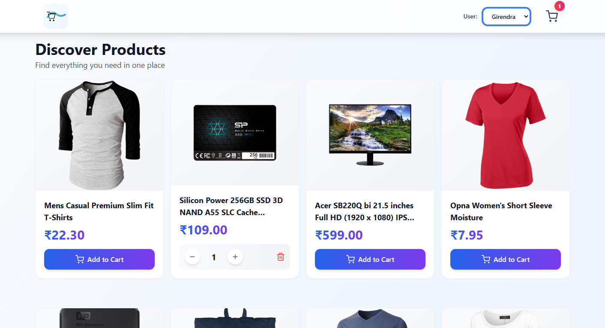

# Vibe Commerce Cart

A modern, full-stack e-commerce shopping cart application built with React, Node.js, Express, and MongoDB. This project demonstrates a complete e-commerce solution with user management, product browsing, cart functionality, and checkout processing.

## 🚀 Features

### Core Functionality
- **Product Browsing**: Grid-based product display with lazy loading for optimal performance
- **Shopping Cart**: Add, update, and remove items with real-time quantity management
- **User Management**: Multi-user support with persistent cart data per user
- **Checkout Process**: Complete order processing with receipt generation
- **Responsive Design**: Mobile-first approach with TailwindCSS styling

### Technical Features
- **Real-time Updates**: Instant cart synchronization across components
- **Lazy Loading**: Intersection Observer API for performance optimization
- **Notification System**: Toast notifications for user feedback
- **Smooth Animations**: CSS transitions and keyframe animations
- **Error Handling**: Comprehensive error management with user-friendly messages
- **CORS Support**: Configured for frontend-backend communication

## ScreenShots




## 🛠 Technology Stack

### Backend
- **Runtime**: Node.js
- **Framework**: Express.js
- **Database**: MongoDB with Mongoose ODM
- **Environment**: dotenv for configuration management
- **CORS**: Cross-origin resource sharing setup

### Frontend
- **Framework**: React 19 with Hooks
- **Build Tool**: Vite for fast development and building
- **Styling**: TailwindCSS with custom animations
- **Routing**: React Router DOM v7
- **HTTP Client**: Axios for API communication
- **Icons**: React Icons (Feather icons)
- **Linting**: ESLint with React-specific rules

### Development Tools
- **Package Manager**: npm
- **Version Control**: Git
- **IDE**: Visual Studio Code
- **Database**: MongoDB Atlas (cloud-hosted)

## 📋 Prerequisites

Before running this application, ensure you have the following installed:

- **Node.js** (v16 or higher)
- **npm** (comes with Node.js)
- **MongoDB** account (for database connection)
- **Git** (for version control)

## 🔧 Installation

### 1. Clone the Repository
```bash
git clone https://github.com/Giru-03/vibe-commerce-cart.git
cd vibe-commerce-cart
```

### 2. Backend Setup
```bash
cd backend
npm install
```

Create a `.env` file in the backend directory:
```env
MONGO_URI=your_mongodb_connection_string
PORT=5000
```

### 3. Frontend Setup
```bash
cd ../frontend
npm install
```

### 4. Database Configuration
- Create a MongoDB database (local or cloud via MongoDB Atlas)
- Update the `MONGO_URI` in `backend/.env` with your connection string
- The application will automatically create collections for Products, Users, and Carts

## 🚀 Usage

### Development Mode

1. **Start the Backend Server**:
```bash
cd backend
npm run dev
```
The server will start on `http://localhost:5000`

2. **Start the Frontend Development Server**:
```bash
cd frontend
npm run dev
```
The application will be available at `http://localhost:5173`

### Production Build

1. **Build the Frontend**:
```bash
cd frontend
npm run build
```

2. **Start the Backend**:
```bash
cd backend
npm start
```

## 📖 API Documentation

### Base URL
```
http://localhost:5000/api
```

### Authentication
Most endpoints require a user identifier sent via header:
```
x-user-id: user@example.com
```


### Endpoints

#### Products
- **GET /products**
  - Retrieve all products
  - Response: Array of product objects

#### Cart Management
- **GET /cart**
  - Get user's cart with populated product details
  - Response: Cart object with items and total

- **POST /cart**
  - Add item to cart
  - Body: `{ productId: "string", qty: number }`
  - Response: Updated cart

- **PUT /cart/:itemId**
  - Update item quantity
  - Body: `{ quantity: number }`
  - Response: Updated cart

- **DELETE /cart/:itemId**
  - Remove item from cart
  - Response: Updated cart

#### Checkout
- **POST /checkout**
  - Process order and clear cart
  - Body: `{ name: "string", email: "string", cartItems: [...] }`
  - Response: Receipt object

#### Users
- **GET /users**
  - Retrieve all users (for user switcher)
  - Response: Array of user objects (name, email)

## 🏗 Project Structure

```
vibe-commerce-cart/
├── backend/
│   ├── models/
│   │   ├── Cart.js          # Cart schema with items and total
│   │   ├── Product.js       # Product schema
│   │   └── User.js          # User schema
│   ├── routes/
│   │   ├── cart.js          # Cart-related endpoints
│   │   └── users.js         # User management endpoints
│   ├── .env                 # Environment variables
│   ├── package.json         # Backend dependencies
│   └── server.js            # Express server setup
├── frontend/
│   ├── public/
│   │   ├── favicon.svg
│   │   └── vite.svg
│   ├── src/
│   │   ├── api.js           # Axios configuration
│   │   ├── App.jsx          # Main app component
│   │   ├── main.jsx         # React entry point
│   │   ├── index.css        # Global styles and animations
│   │   ├── components/
│   │   │   ├── CartItem.jsx         # Individual cart item
│   │   │   ├── CheckoutForm.jsx     # Checkout form
│   │   │   ├── LoadingSpinner.jsx   # Loading indicator
│   │   │   ├── NotificationContext.jsx
│   │   │   ├── NotificationProvider.jsx
│   │   │   ├── ProductCard.jsx      # Product display card
│   │   │   ├── ReceiptModal.jsx     # Order confirmation
│   │   │   └── UserSwitcher.jsx     # User selection dropdown
│   │   └── pages/
│   │       ├── CartPage.jsx         # Cart and checkout page
│   │       └── Home.jsx             # Product listing page
│   ├── package.json         # Frontend dependencies
│   ├── vite.config.js       # Vite configuration
│   └── index.html           # HTML template
└── README.md                # This file
```

## 🔄 Data Flow

1. **User Selection**: UserSwitcher sets user ID in API headers and localStorage
2. **Product Loading**: Home page fetches products from `/api/products`
3. **Cart Operations**: ProductCard/CartItem components call cart APIs
4. **Real-time Updates**: Components listen for user change events to refresh data
5. **Checkout**: CartPage submits order to `/api/checkout`, receives receipt

## 🎨 UI/UX Features

- **Modern Design**: Gradient backgrounds and smooth transitions
- **Accessibility**: ARIA labels, keyboard navigation, semantic HTML
- **Performance**: Lazy loading, code splitting, optimized images
- **Mobile Responsive**: Adaptive layouts for all screen sizes
- **Visual Feedback**: Loading states, hover effects, animations

## 🧪 Development Notes

### Seeding Data
The backend includes a seed script (currently referenced but not implemented):
```bash
cd backend
npm run seed
```

### Environment Variables
- `MONGO_URI`: MongoDB connection string
- `PORT`: Server port (defaults to 5000)

### User Management
- Users are fetched from database for the switcher
- Cart data persists per user

### Error Handling
- Backend: Centralized error handler with status codes
- Frontend: Try-catch blocks with user notifications
- Network errors are gracefully handled

## 🤝 Contributing

1. Fork the repository
2. Create a feature branch (`git checkout -b feature/amazing-feature`)
3. Commit your changes (`git commit -m 'Add amazing feature'`)
4. Push to the branch (`git push origin feature/amazing-feature`)
5. Open a Pull Request

## 📄 License

This project is licensed under the MIT License - see the LICENSE file for details.

## 👥 Authors

- **Giru** - *Initial work* - [Giru-03](https://github.com/Giru-03)

## 🙏 Acknowledgments

- React and Vite documentation
- TailwindCSS for styling
- MongoDB Atlas for database hosting
- Open source community for inspiration

---

**Note**: This is a demonstration project showcasing full-stack development with modern web technologies. For production use, additional security measures, testing, and deployment configurations would be required.
